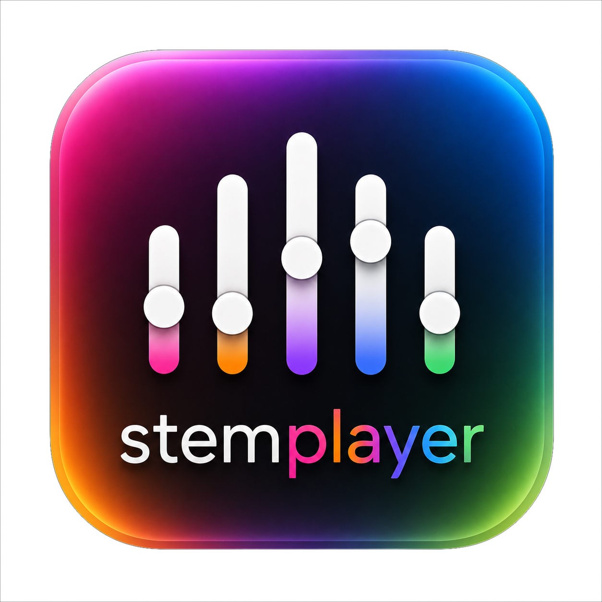

# 🎵 StemPlayer

**Reproductor y mezclador de stems de audio** con detección automática de tonalidad y tempo, ajuste de pitch/tempo por pista, generación de ChordPro con IA y streaming de letras sincronizadas a cualquier navegador.

<p align="center">
  
</p>

<p align="center">
  <a href="LICENSE"></a>
  <a href="https://www.python.org/"></a>
  <a href="https://github.com/bay122/stemplayer/releases"></a>
  <a href="https://github.com/bay122/stemplayer"></a>
</p>

---

## ✨ Características

- **Carga de stems**: Importa múltiples archivos de audio (WAV, MP3, M4A, FLAC) desde una carpeta
- **Detección automática**: Analiza el mix para detectar tonalidad (key) y tempo (BPM)
- **Pitch shift**: Cambia la tonalidad en semitonos (-3 a +3) por stem o global
- **Tempo**: Ajusta el BPM con Rubber Band
- **Controles por stem**: Volumen, paneo, mute, solo, categoría, renombrar y reordenar
- **Count-in y Metrónomo**: Compases de entrada configurables, metrónomo persistente
- **Librería persistente**: Guarda canciones con metadatos JSON y múltiples librerías
- **Exportación**: ZIP o WAV, con configuración actual o stems originales
- **Setlists**: Listas de reproducción con auto-avance, pre-carga y reordenación
- **Undo/Redo**: Historial completo de ajustes con detección de cambios no guardados
- **ChordPro**: Vista previa, editor con botones de acordes, exportación a PDF, modo Live Chords
- **Editor de Sync**: Editor visual con waveform, tabla de tiempos y previsualización ChordPro
- **Streaming Live Chords**: Transmite la letra sincronizada a cualquier navegador en la red local vía HTTP + QR
- **Filtros de stems**: Clasificación automática (click, guía, sin FX) por patrón de nombre
- **Temas externos**: Sistema de temas plugin con colores, QSS, iconos SVG y layout extensible
- **Proveedores IA**: OpenRouter y Google AI Studio para generación de acordes y sincronización
- **Sync con Whisper**: Regeneración de timestamps vía faster-whisper + refinamiento con IA
- **Caché de audio**: Dos niveles (mono WAV + pitch/tempo) para recarga rápida
- **Medidores de sistema**: CPU, RAM y pico de audio en tiempo real

---

## 📥 Descargar

Descarga la última versión compilada desde [Releases](https://github.com/bay122/stemplayer/releases):

| Plataforma | Archivo |
|------------|---------|
| Windows    | `StemPlayer.exe` (portátil, sin instalación) |
| Linux      | `StemPlayer` (binario, sin dependencias) |

---

## 🛠 Compilar desde código

### Requisitos

- Python 3.10 o superior
- pip

### Instalación

```bash
git clone https://github.com/bay122/stemplayer.git
cd stemplayer
python -m venv penv
source penv/bin/activate   # Linux/Mac
# .\penv\Scripts\Activate.ps1   # Windows
pip install -r requirements.txt
```

### Uso

```bash
python main.py                  # Tema oscuro por defecto
python main.py -theme stemdeck  # Tema StemDeck
python main.py -theme theme3    # Tema con layout extendido
```

### Compilar ejecutable

```bash
pip install pyinstaller
pyinstaller StemPlayer.spec
```

El binario se genera en `dist/StemPlayer/`.

---

## 🔧 Configuración

1. Copia `.env_example` a `.env` y completa tu API key de OpenRouter o Google AI Studio
2. Ejecuta la aplicación y configura la carpeta de canciones en el panel izquierdo
3. ¡Listo para reproducir!

---

## 📚 Documentación

| Documento | Descripción |
|-----------|-------------|
| [`docs/user_guide.md`](docs/user_guide.md) | Guía de usuario completa |
| [`docs/architecture.md`](docs/architecture.md) | Arquitectura y estructura del proyecto |
| [`docs/theming.md`](docs/theming.md) | Sistema de temas y guía para crear nuevos |
| [`docs/threading.md`](docs/threading.md) | Gestión de hilos y Thread Safety |
| [`docs/api.md`](docs/api.md) | API de proveedores IA |
| [`BUILDING.md`](BUILDING.md) | Compilación con PyInstaller |

---

## 🧪 Tests

```bash
python -m pytest test/
```

Los tests requieren archivos de audio de ejemplo (no incluidos en el repositorio). Consulta `test/README.md` para más detalles.

---

## 🤝 Contribuir

Las contribuciones son bienvenidas. Por favor:

1. Haz fork del proyecto
2. Crea una rama para tu feature (`git checkout -b feature/nueva-funcionalidad`)
3. Haz commit de tus cambios (`git commit -m 'feat: agregar nueva funcionalidad'`)
4. Haz push a la rama (`git push origin feature/nueva-funcionalidad`)
5. Abre un Pull Request

---

## 📄 Licencia

Este proyecto está bajo licencia **CC BY-NC-SA 4.0**. Ver el archivo [`LICENSE`](LICENSE) para más detalles.

Resumen: puedes compartir y modificar el código **siempre que**:
- Des el crédito correspondiente (atribución)
- No lo uses con fines comerciales
- Distribuyas tus modificaciones bajo la misma licencia

---

## 👤 Autor

**Pablo Jiménez**  
[GitHub](https://github.com/bay122) · [Web](https://pablo-jimenez.site) · [Email](mailto:pablo.jimenez@users.noreply.github.com)
